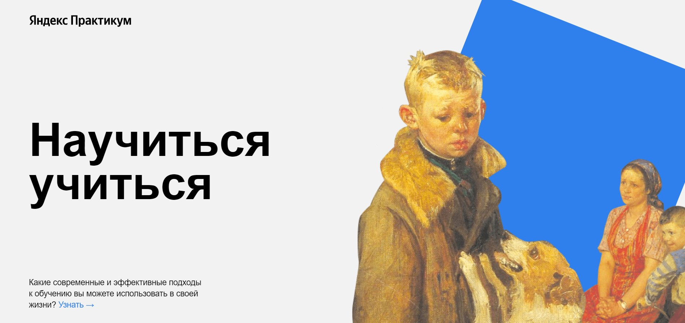
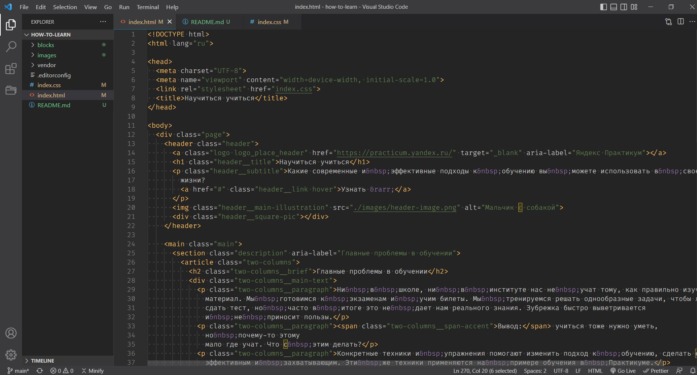

# Yandex Practicum. Научиться учиться

Данный сайт был создан в ходе прохождения курса «Веб‐разработчик» от Яндекс Практикума. Он посвящён теме современных принципов обучения. Темы курса, затронутые при вёрстке сайта:

- flexbox
- БЭМ
- Git
- iframe
- анимации

---

TODO:

1. Добавить локально шрифт: <https://fonts.google.com/specimen/Play>
2. Между блоками resources и footer добавить форму обратной связи.
3. Дописать стили для адаптивность сайта под разные устройства.
